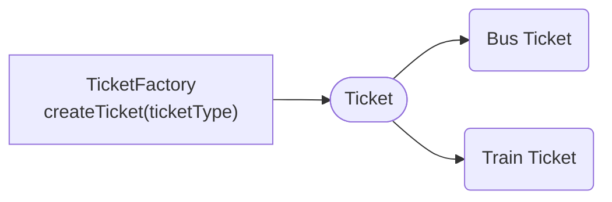
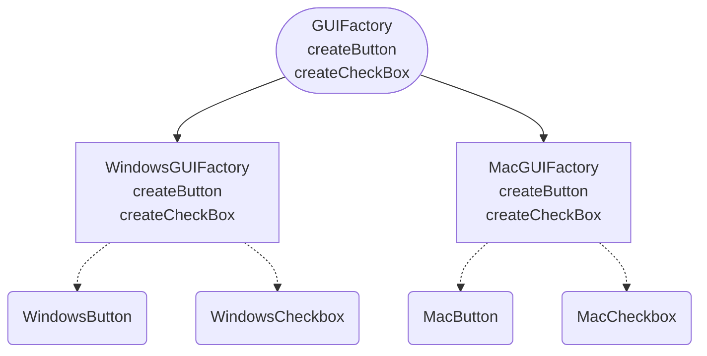

Why reinvent the wheel? Design patterns are the solutions to common problems that developers face while writing code.

## Creational Design Patterns

A set of design patterns to help manage the complexity of growing programming logic.

```scala
// Let’s say there is a class Invoice
class Invoice {
...
}

// Over time we would add new classes that use the invoice class like this.
new Invoice();
```

Then one day we might need to change how invoice objects are created. For example, we might want to change the constructor, or we might want to have different configurations for different types of invoice. This is tricky because now all the code is tightly coupled to the Invoice class. So I have to change it everywhere. And that starts a domino effect of changes that need to be made.

There are two main themes common to most creational design patterns:

- They encapsulate knowledge about which concrete class the system should use.
- They conceal how the objects are created.

### Builder Design Pattern


- A Separate ConcreteBuilder class used to construct the object using just the fields that we want.
- Director is the class where you use the Builder to create Class object.
- We make `Builder` a static inner class because it's **logically tied to the outer class**, **can access private members ()**, **doesn't require an outer instance**, and **keeps the API clean**.

Mainly:

- Make the constructor Private to prevent normal instantiation.
- Have an inner static class so that it is able to access the private constructor.
- To avoid using the long form parametrized constructor, we can have the improved Builder pattern by passing ConcreteBuilder class to the Class constructor (build method will have ``return new Person(this);``).

### Singleton Design Pattern

- Antipattern

Use-cases:

- Connection to a database.
- Access to configuration files.
- Access to hardware resources like printers.
- Loggers

Mainly:

- Make the class final so that it can’t be extended.
- Make the constructor private to prevent normal instantiation.
- Create a private static instance field in the class. (because non static members cannot be referenced from a static context and the getInstance method will be static)
- Create a public static method to return the instance object and to initialize it if it is null.

Thread Safety:

If multiple threads call the getInstance() method at the same time, there can be multiple instances of the class.

One of the things to consider when implementing this pattern is thread safety. If you have multiple threads in your application, each one could create a new instance of the singleton, which defeats the point.

Making Singletons Thread Safe:

- Eager Initialization:

```java
public class Singleton {
	// Eager initialization - instance is created when the class is loaded
	private static final Singleton instance = new Singleton();
	private Singleton() {}
	public static Singleton getInstance() {
	    return instance;
	}
}
```

- Lazy Initialization:

```java
public class Singleton {
    private static Singleton instance;
    private Singleton() {}
		// Lazy initialization - the instance is created only when it's first needed
    public static synchronized Singleton getInstance() {
        if (instance == null) {
            instance = new Singleton();
        }
        return instance;
    }
}
```

- Double Checked Locking:

```java
public class Singleton {
    private static volatile Singleton instance;

    private Singleton() {}
    // will only lock if the instance is null, hence more efficient
    public static Singleton getInstance() {
        if (instance == null) {  // First check (no lock)
            synchronized (Singleton.class) { // locking on the class itself
                if (instance == null) {  // Second check (with lock)
                    instance = new Singleton();
                }
            }
        }
        return instance;
    }
}
```

- Enum Singleton

```java
public enum Singleton {
    INSTANCE;

    // You can add methods here
    public void someMethod() {
        // some logic
    }
}
```

- **`Singleton.INSTANCE` is the instance**, and even though it’s an **enum constant**, it’s **still the single instance** of the Singleton class.
- The enum type guarantees that the instance is created lazily and is thread-safe, and the JVM ensures only one instance is created.
- You interact with it just like any instance of a class, but **you don’t need to worry about thread-safety** or other issues associated with traditional Singleton patterns.

Cons:

- Violates the Single Responsibility Principle. It does class logic + ensures only one instance is created.
- Singletons also make your codes difficult to test, because the objects that use the singleton are tightly coupled to the singleton objects.

### Prototype Design Pattern

- Allows you to create new objects by copying an existing object (a prototype), rather than creating a new object from scratch.

Mainly:

- **Prototype**: An object that is used as a blueprint for creating copies.
- **Clone Method**: You manually define a `clone` method to create and return a new instance.

| Clone Type | Address Object Shared? | Safe from Mutation? |
| --- | --- | --- |
| Shallow Clone | ✅ Yes | ❌ No |
| Deep Clone | ❌ No | ✅ Yes |

### Factory Design Pattern

- It handles deciding which type of concrete class needs to be created by another class.
- use the factory pattern when you have a class that's responsible for creating objects of another type of class, but that class doesn't know in advance which concrete types of the class it should create.



- Functional ticket Factory using map of ticket type to lambdas solves the problem of have multiple if else blocks.
- It streamlines adding new ticket types by simply updating a Map rather than modifying the factory method.

```java
public class FunctionalTicketFactory {
    private static final Map<TicketType, Supplier<Ticket>> ticketMap = new HashMap<>();

    static {
        ticketMap.put(TicketType.BUS, BusTicket::new);
        ticketMap.put(TicketType.TRAIN, TrainTicket::new);
    }
    Ticket createTicket(TicketType ticketType) {
        return ticketMap.get(ticketType).get();
    }
}
```

### Abstract Factory Design Pattern

- Factory of factories
- Is used for applications that have families of objects.
- The family of related objects should be used together.
- Complex class Hierarchy
- Concrete classes are isolated from the client


